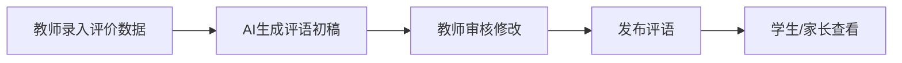
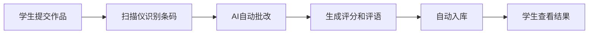

# 学生综合素质评价系统

<div align="center">

**一个基于AI的小学生综合素质评价与管理系统**

[](https://python.org)
[](https://reactjs.org)
[](https://fastapi.tiangolo.com)
[](https://mysql.com)

</div>

---

## 📖 系统简介

这是一个专为小学设计的综合素质评价管理系统，集成了**AI智能评语生成**、**多维度评价录入**、**数据可视化展示**等功能，帮助学校实现对学生全面、科学、高效的素质评价。

### 核心特色

- 🤖 **AI评语生成**: 基于千问大模型，自动生成个性化、温暖的期末评语
- 📊 **多维度评价**: 支持学业成绩、体育健康、艺术素养、德育等多方面评价
- 📈 **数据可视化**: ECharts雷达图直观展示学生综合素质
- ✍️ **书法批改**: 集成扫描仪，自动识别学生作品并AI批改
- 👥 **三端分离**: 管理员、教师、学生三个角色独立操作界面

---

## 🚀 快速开始

### 系统要求

- **操作系统**: Windows 10+  / Linux / macOS
- **Python**: 3.9 或更高版本
- **Node.js**: 16 或更高版本
- **MySQL**: 8.0 或更高版本
- **浏览器**: Chrome / Edge / Firefox 最新版本

### 1. 数据库初始化

```bash
# 登录MySQL
mysql -u root -p

# 创建数据库
CREATE DATABASE calligraphy_ai CHARACTER SET utf8mb4 COLLATE utf8mb4_unicode_ci;

# 导入数据库结构
USE calligraphy_ai;
SOURCE database/init_full.sql;
```

### 2. 后端启动

```bash
# 安装Python依赖
pip install -r requirements.txt

# 配置千问API密钥（可选，用于AI评语生成）
# 编辑 src/api/qwen_client.py，填入您的API Key

# 启动FastAPI后端
python run_web.py
```

后端服务将在 `http://localhost:8000` 启动

### 3. 前端启动

```bash
# 进入前端目录
cd frontend

# 安装依赖
npm install

# 启动开发服务器
npm run dev
```

前端服务将在 `http://localhost:5173` 启动

### 4. 访问系统

在浏览器中打开 `http://localhost:5173`

**默认管理员账号**: 
- 用户名: `admin`
- 密码: `admin123`

---

## 📚 功能模块

### 👨‍💼 管理员端

| 功能模块 | 说明 |
|---------|------|
| **学期管理** | 创建和管理学年学期 |
| **班级管理** | 管理年级班级，分配班主任 |
| **学生管理** | 学生信息录入，生成学生条码 |
| **教师管理** | 教师信息管理，权限分配 |
| **指标管理** | 配置评价指标体系 |
| **统计报表** | 查看全校统计数据 |

### 👨‍🏫 教师端

| 功能模块 | 说明 |
|---------|------|
| **数据录入** | 批量录入学生评价数据 |
| **评语管理** | AI生成评语，教师审核编辑 |
| **书法批改** | 查看AI书法批改结果 |
| **班级管理** | 查看所带班级信息 |

### 👨‍🎓 学生端

| 功能模块 | 说明 |
|---------|------|
| **个人信息** | 查看个人基本信息 |
| **评价数据** | 查看各项评价结果 |
| **雷达图** | 可视化展示综合素质 |
| **期末评语** | 查看教师评语 |
| **书法成绩** | 查看书法作品批改记录 |

---

## 🎯 使用场景

### 场景 1: 期末评价工作流程



1. **教师录入数据**: 通过"数据录入"页面，按班级、指标批量录入学生评价
2. **AI生成评语**: 点击"批量生成AI评语"，系统自动为每个学生生成个性化评语
3. **教师审核**: 在"评语管理"页面预览、编辑AI评语
4. **发布评语**: 确认无误后，点击"发布"让学生和家长可见
5. **学生查看**: 学生通过学号和姓名登录，查看评语和雷达图

### 场景 2: 书法作业批改



1. 学生在作品上贴上条码
2. 扫描仪自动识别条码和作品
3. AI自动评分并生成评语
4. 结果自动保存到数据库
5. 学生可以在系统中查看

---

## 🛠️ 技术架构

### 后端技术栈

- **Web框架**: FastAPI (高性能异步框架)
- **数据库**: MySQL 8.0 (关系型数据库)
- **AI模型**: 阿里云千问 (Qwen) 大语言模型
- **认证**: JWT Token
- **图像处理**: OpenCV, PIL
- **条码识别**: pyzbar

### 前端技术栈

- **框架**: React 18 + TypeScript
- **UI组件**: Ant Design 5
- **图表库**: ECharts 5
- **状态管理**: Zustand
- **路由**: React Router 6
- **HTTP客户端**: Axios

### 系统架构图

```
┌─────────────────────────────────────────────┐
│              Nginx (反向代理)                │
└──────────────┬────────────┬─────────────────┘
               │            │
    ┌──────────▼─────┐  ┌──▼──────────────┐
    │  React前端      │  │  FastAPI后端    │
    │  端口: 3000    │  │  端口: 8000     │
    └────────────────┘  └─────┬────────────┘
                               │
                    ┌──────────┴──────────┐
                    │                     │
            ┌───────▼──────┐      ┌──────▼──────┐
            │  MySQL数据库  │      │  千问AI API  │
            └──────────────┘      └─────────────┘
```

---

## 📋 数据库设计

### 核心表结构

```sql
users                      -- 用户表（管理员/教师/学生）
├── semesters              -- 学期表
├── grades                 -- 年级表
├── classes                -- 班级表
├── students               -- 学生表
├── teachers               -- 教师表
├── indicator_categories   -- 评价指标分类
├── indicators             -- 评价指标
├── evaluations            -- 学生评价数据
├── semester_comments      -- 学期评语
└── grading_records        -- 书法批改记录
```

---

## 🔧 配置说明

### 后端配置

编辑 `src/web/auth/dependencies.py`:

```python
DB_CONFIG = {
    'host': 'localhost',      # MySQL主机
    'user': 'root',           # MySQL用户名
    'password': 'your_password',  # MySQL密码
    'database': 'calligraphy_ai',
    'charset': 'utf8mb4'
}
```

编辑 `src/api/qwen_client.py`:

```python
QWEN_API_KEY = "your_qwen_api_key"  # 千问API密钥
```

### 前端配置

编辑 `frontend/src/services/api.ts`:

```typescript
const BASE_URL = 'http://localhost:8000'  // 后端API地址
```

---

## 📖 API文档

启动后端后，访问 `http://localhost:8000/docs` 查看完整的API文档（Swagger UI）

### 主要API端点

| 端点 | 方法 | 说明 |
|------|------|------|
| `/api/auth/login` | POST | 用户登录 |
| `/api/admin/students` | GET | 获取学生列表 |
| `/api/teacher/evaluations/batch` | POST | 批量录入评价 |
| `/api/teacher/comments/generate` | POST | 生成AI评语 |
| `/api/student/query` | POST | 学生信息查询 |

---

## 🎨 截图展示

### 教师数据录入页面


### AI评语管理页面


### 学生雷达图


---

## 🤝 贡献指南

欢迎贡献代码、报告问题或提出建议！

1. Fork 本仓库
2. 创建您的特性分支 (`git checkout -b feature/AmazingFeature`)
3. 提交您的更改 (`git commit -m 'Add some AmazingFeature'`)
4. 推送到分支 (`git push origin feature/AmazingFeature`)
5. 开启一个 Pull Request

---

## 📄 许可证

本项目采用 MIT 许可证 - 详见 [LICENSE](LICENSE) 文件

---

## 💬 联系方式

- **项目问题**: 请在 GitHub Issues 中提出
- **功能建议**: 欢迎在 Discussions 中讨论

---

## 🙏 致谢

- [FastAPI](https://fastapi.tiangolo.com/) - 现代化的Web框架
- [React](https://reactjs.org/) - 用户界面库
- [Ant Design](https://ant.design/) - 企业级UI组件库
- [ECharts](https://echarts.apache.org/) - 数据可视化库
- [Qwen (千问)](https://tongyi.aliyun.com/) - AI大语言模型

---

<div align="center">

**用AI赋能教育，用科技助力成长** 🌟

Made with ❤️ by Antigravity AI

</div>
